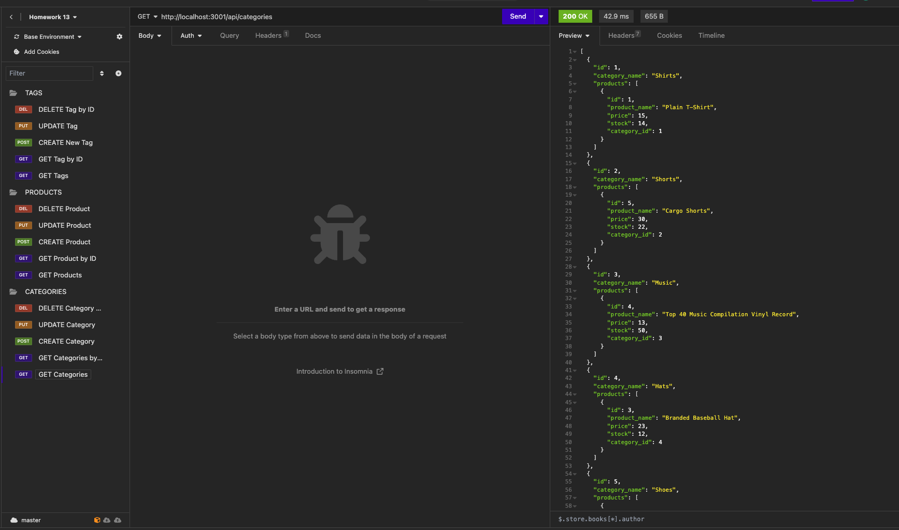
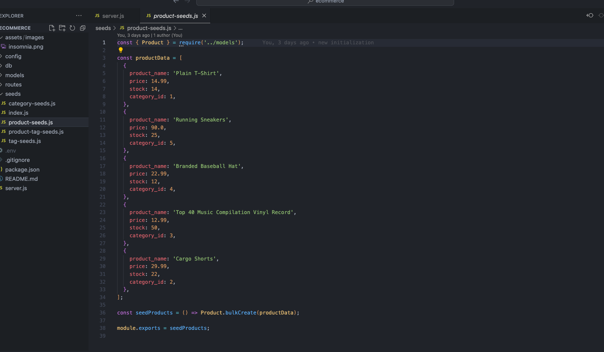

# Ecommerce-backend-database
[](https://github.com/DigitallyIntrinsic/ecommerce/issues) [](https://github.com/DigitallyIntrinsic/ecommerce/graphs/contributors) 
## Description
This application was created so that internet retail companies can utilize a MySQL database and keep an up to date record of specific categories, products, and tags related to the sale, and inventory of their e-commerce business.
          
View the deployed page at [Ecommerce-backend-database](not applicable).
## Contents
* [Usage](#usage)
   * [Screenshots](#screenshots)
* [Built With](#built-with)
* [License](#license)
* [Contributing](#contributing)
* [Questions](#questions)
* [Credits](#credits)

## Installation
To use this application, please install: 
```
To use this application, you must utilize Node.js, SQL and JavaScript. The dependencies from npm that are required are as follows: Sequelize, mysql2, dotenv, inquirer, and chalk.
```

## Usage
A user can use this application by running and testing of routes with applications like Insomnia or strictly through using a MySQL shell. Once the database has been created, seeded, and the server started, users can interact with the database through routing of different api end points. 
  
### Screenshots





## License
This application is licensed under the MIT license.
  
## Contributing
There are no guidelines for contributing, please fork and use as required.


## Built With

* JavaScript
* Node.js
* Express.js
  
## Questions
If you have any questions about the repo, please [open an issue](https://github.com/DigitallyIntrinsic/ecommerce/issues) or contact me via email at gitboot@1002.us. You can find more of my work on my GitHub, [DigitallyIntrinsic](https://github.com/DigitallyIntrinsic/).
  
## Credits
* Bootcamp Starter Code
* [ChatGPT](https://chat.openai.com/)

  
